# Build Guide

This build guide assumes the reader has some experience with building open-source electronics kits.

The PCBs have been designed with partial assembly from [JLCPCB](https://jlcpcb.com/quote){:target="_blank"} in mind. Hand soldering through-hole components will be required once ordered PCBs arrive.

It's recommended to have access to a 3D printer. Some of the parts are designed to be 3D printed, such as the case and button caps. Optionally a 3D printing service such as [JLC3DP](https://jlc3dp.com/3d-printing-quote){:target="_blank"} could be used.

## Part Ordering

All parts required to populate the PCBs can be purchased from LCSC/JLCPCB with the following exceptions:

- Transformers - Usually in stock at Mouser.
- Potentiometers - Available at Mouser. Available as a preorder item at LCSC at the time of writing.
- Rotary Encoders - Available at Mouser. Out of stock at LCSC at the time of writing.

BOM lists are available with associated zipped gerber files located in the `/pcb` directory. Each list is split in two, one for the surface mount components intended for the JLCPCB assembly service (`*.bom.csv`), and another for through-hole components (`*.bom-hand_assembly.csv`).

This allows for easy ordering of through-hole components at LCSC via their [BOM Tool](https://www.lcsc.com/bom){:target="_blank"}.

*[BOM]: Bill of Materials

## Misc Parts

Parts that don't fit the assembly BOM files are placed in the BOM file located in the `/docs/assets` directory.

{{ read_csv('assets/bom.misc.csv') }}

## PCB Ordering

The following provides recommended settings for ordering PCBs and getting them assembled. If an option isn't specified it's assumed to be set to the default setting provided by JLCPCB.

Component rotations in CPL files should be correct, but I recommend to double check them anyway during checkout.

??? info "About order quantity"
    Please note that the minimum order quantity for PCB Assembly at JLCPCB is two, while the minimum for PCB fabrication is five. Additionally certain components have a minimum assembly quantity of five (and attrition quantity but we will ignore that for now).

    If you order two assembled boards each using one component, and this component has a minimum assembly quantity of five, it will still use five components. You then will receive two assembled and three blank PCBs.

    Additionally initial setup fees don't scale with order quantity, so ordering five is more efficient than ordering two assembled boards.

### Main Board

Asset       | File
----------- | -----------
Gerbers     | `main_board.zip`
BOM         | `main_board.bom.csv`
CPL         | `main_board.top-cpl.csv`

Option                 | Value
---------------------- | ----------------------
Base Material          | FR-4
Layers                 | 4
PCB Thickness          | 1.6mm
Outer Copper Weight    | 1oz
Inner Copper Weight    | 0.5oz
Specify Layer Sequence | F_Cu, In1_Cu, In2_Cu, B_Cu
Impedance Control?     | Yes
Layer Stackup          | JLC04161H-7628
Via Covering           | Plugged (free upgrade from tented)
Remove Order Number    | Specify a location

PCB Assembly?          | Yes
---------------------- | ----------------------
PCBA Type              | Economic
Assembly Side          | Top Side

### Output Board

Asset       | File
----------- | -----------
Gerbers     | `output_board.zip`
BOM         | `output_board.bom.csv`
CPL         | `output_board.top-cpl.csv`

PCB Option             | Value
---------------------- | ----------------------
Base Material          | FR-4
Layers                 | 2
PCB Thickness          | 1.6mm
Outer Copper Weight    | 1oz
Via Covering           | Tented
Remove Order Number    | Specify a location

PCB Assembly?          | Yes
---------------------- | ----------------------
PCBA Type              | Economic
Assembly Side          | Top Side

### Front Control Board

Asset       | File
----------- | -----------
Gerbers     | `front_control_board.zip`
BOM         | `front_control_board.bom.csv`
CPL         | `front_control_board.top-cpl.csv`

Option                 | Value
---------------------- | ----------------------
Base Material          | FR-4
Layers                 | 2
PCB Thickness          | 1.6mm
Outer Copper Weight    | 1oz
Via Covering           | Tented
Remove Order Number    | Specify a location

PCB Assembly?          | Yes
---------------------- | ----------------------
PCBA Type              | Standard (required for LEDs and ESP32 module)
Assembly Side          | Top Side
Bake Components?       | Yes (recommended for moisture sensitive LEDs. LEDs have a high chance of being DOA without this)

*[DOA]: Dead on Arrival

### Front Panel

Asset       | File
----------- | -----------
Gerbers     | `front_panel.zip`
BOM         | N/A
CPL         | N/A

Option                 | Value
---------------------- | ----------------------
Base Material          | FR-4
Layers                 | 2
PCB Thickness          | 1.6mm
Outer Copper Weight    | 1oz
Via Covering           | Tented
PCB Color              | Black (suggested for high contrast readable text, feel free to pick any color)
Silkscreen             | White
Remove Order Number    | Specify a location

PCB Assembly?          | No
---------------------- | ----------------------
Front panel has no components {: class="parent-display-none" } | .

*[CPL]: Component Pick List (also known as a POS file)

## Assembly

View the iBOM (`*-ibom.html`) for an overview and guidance on component placement. Use `HandAssembly` as the filter to show only the components needing hand soldering.

See the `*.bom-hand_assembly.csv` and `bom.misc.csv` BOM files for the parts list of components requiring manual assembly.

The sections listed below are in recommended assembly order.

### Front Control Board {: #assembly-front-control-board }

Image of board as it arrived from JLCPCB:

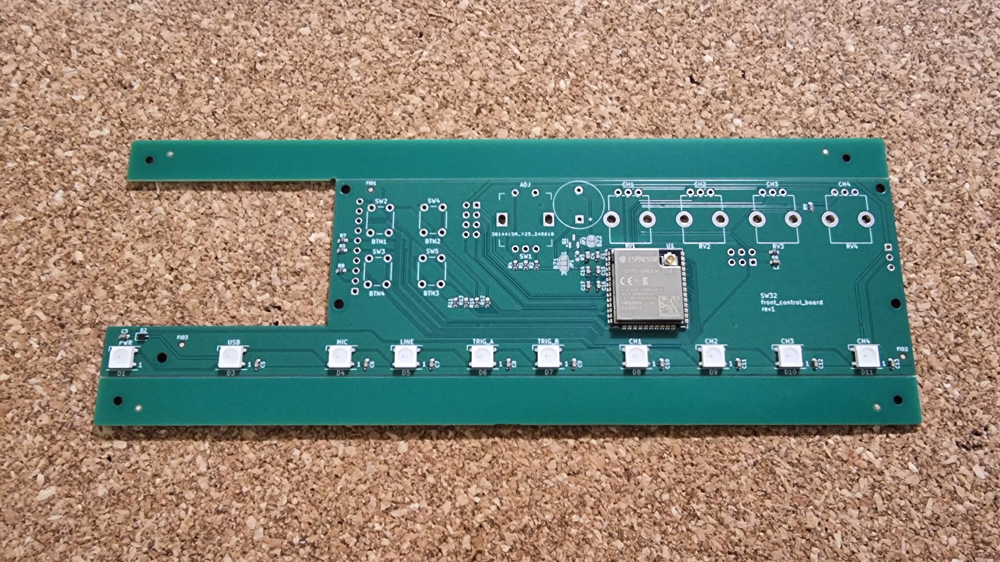{ loading="lazy" width="450" align="left" }

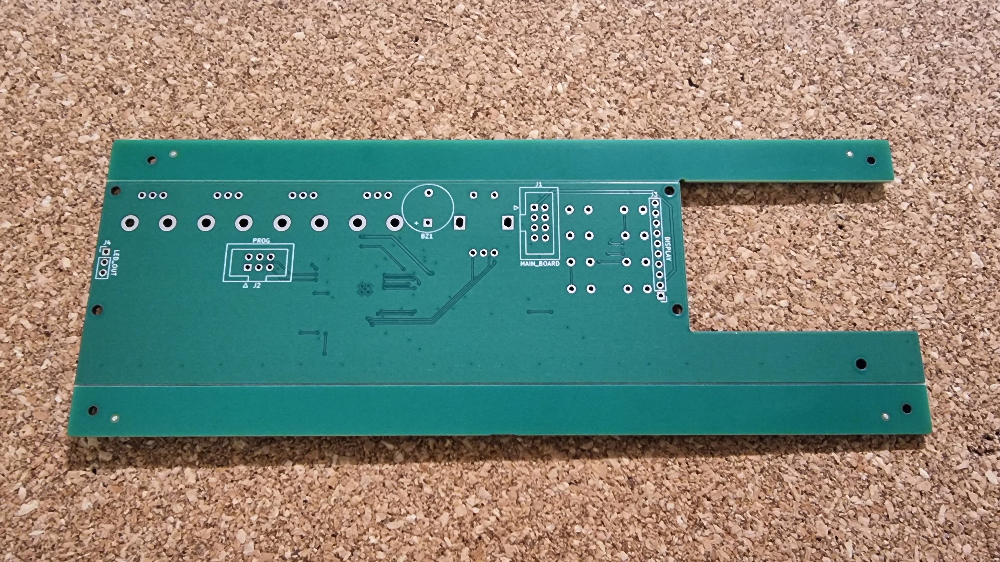{ loading="lazy" width="450" }

- Remove assembly rails by bending along v-cut lines, being careful not to bend the PCB near any of the components.

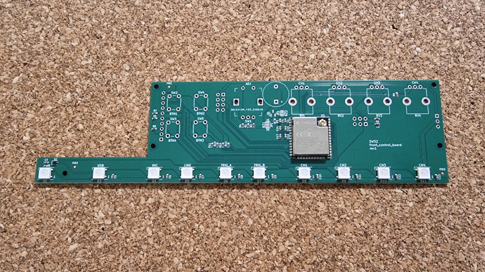{ loading="lazy" width="450" align="left" }

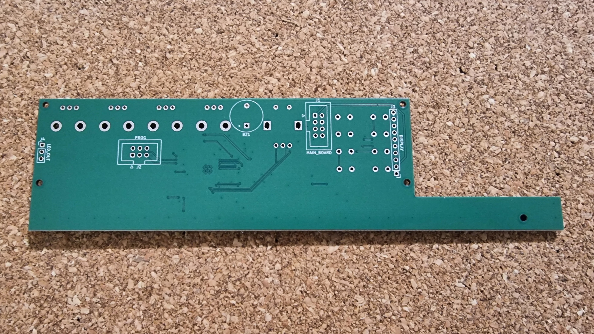{ loading="lazy" width="450" }

- Hand solder through-hole components on the sides indicated by the silkscreen.
    - BZ1 can be installed on the bottom side, or top side if using [10mm standoffs](#misc-parts).
- J4 is optional and only needed if you want to add extra LED strips.
- Recommended to solder back components first (J1, J2, and J3) and optionally J4/BZ1.
- Install 5x standoffs on top side of board.
- Attach the U.FL antenna to the connector on the ESP32 module (U1).

Fully assembled board:

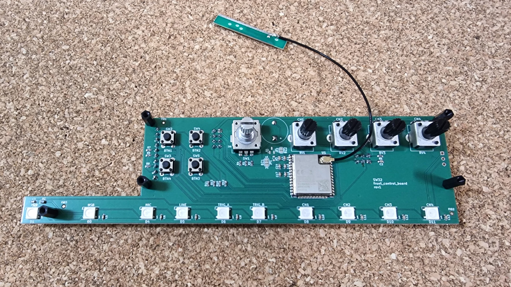{ loading="lazy" width="450" align="left" }

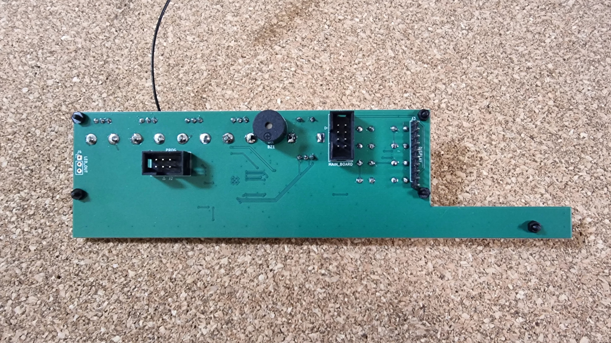{ loading="lazy" width="450" }

### Front Panel {: #assembly-front-panel }

Image of board as it arrived from JLCPCB:

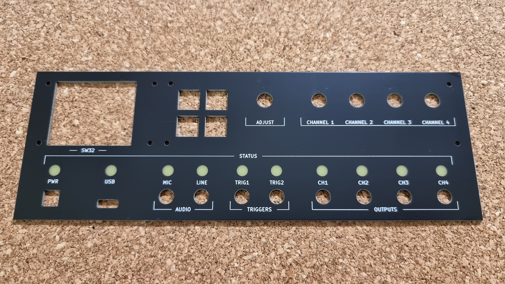{ loading="lazy" width="450" align="left" }

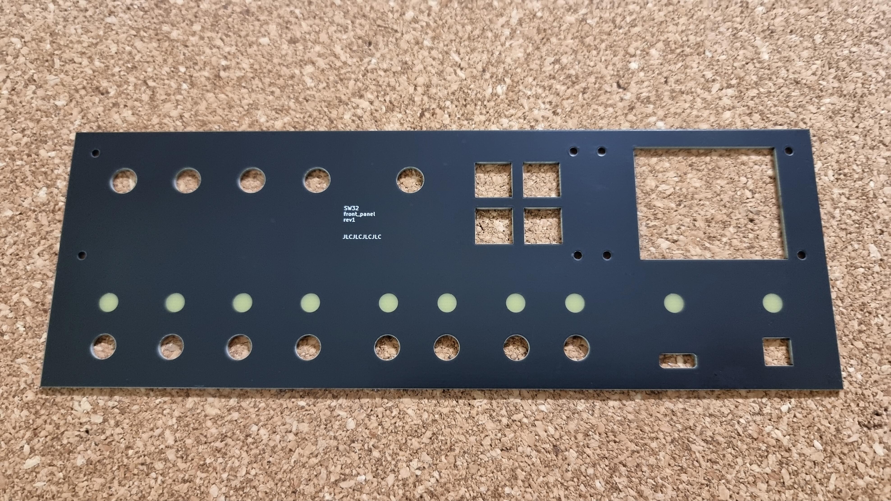{ loading="lazy" width="450" }

- Ensure the display module has a 10P 0.1" pin header soldered on the back.
- Install 4x display standoffs onto display module first, then attach to the front panel with 4x screws.
- Place 4x 10x10 button caps into the holes of the front panel board.
- Install front panel control board onto front panel with 4x screws, so the button caps are captured between the two PCBs.
- Push on the encoder/pot knobs.

Fully assembled board:

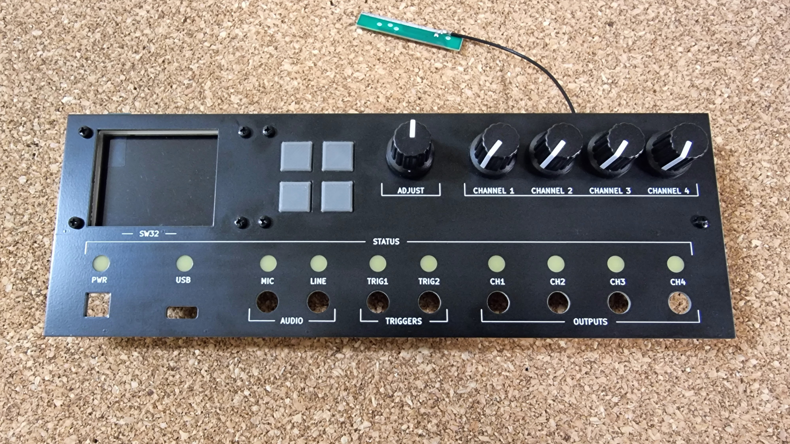{ loading="lazy" width="450" align="left" }

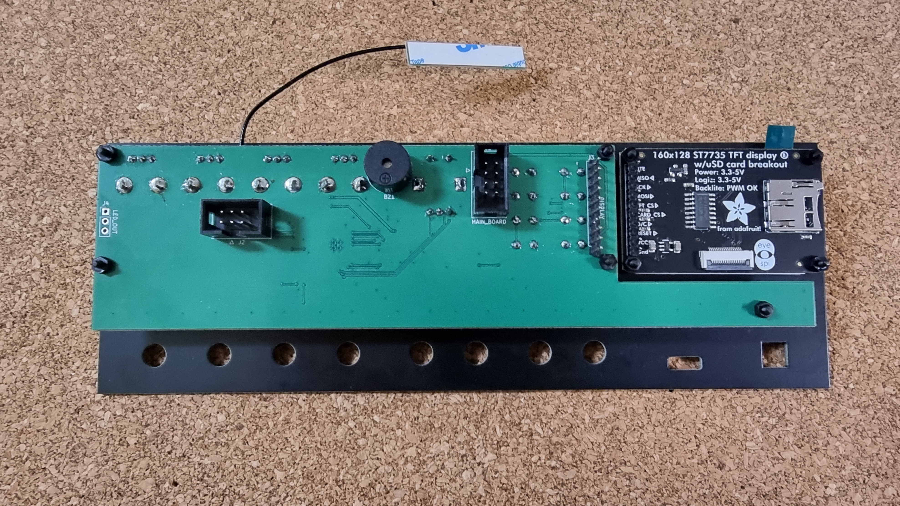{ loading="lazy" width="450" }

### Main Board {: #assembly-main-board }

Image of board as it arrived from JLCPCB:

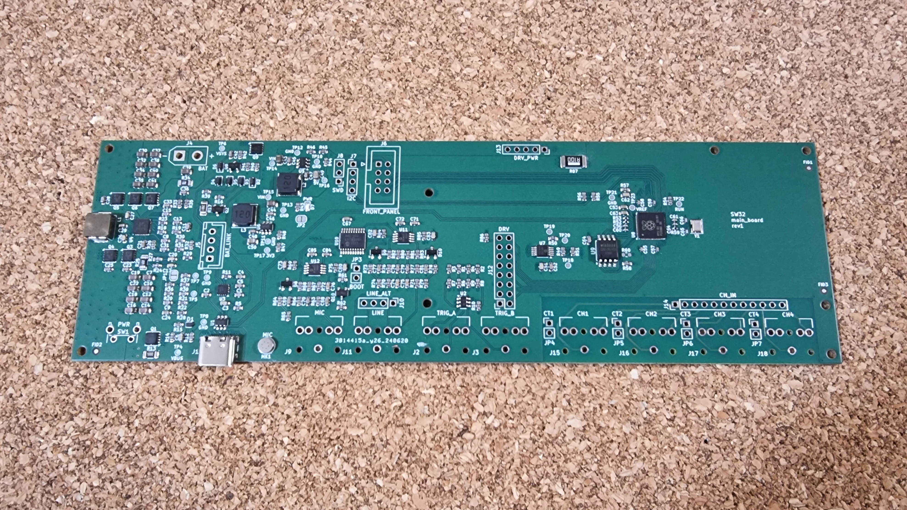{ loading="lazy" width="450" align="left" }

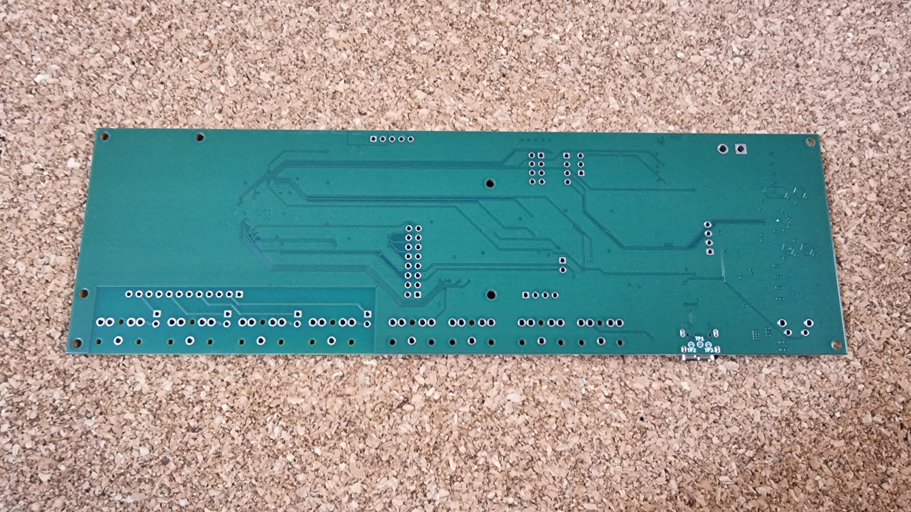{ loading="lazy" width="450" }

- Hand solder through-hole components on the top side (indicated by the silkscreen).
- Recommended to solder SW1 first, then CT1, CT2, CT3, and CT4.
- J7/J8 are optional and only used for debugging and future peripheral addon support.
- Ensure TRS sockets (J15-J18, J2-J3, J9, J11) are aligned with the board edge before soldering, so the front panel will fit cleanly.

*[SWD]: Single Wire Debug

Fully assembled board:

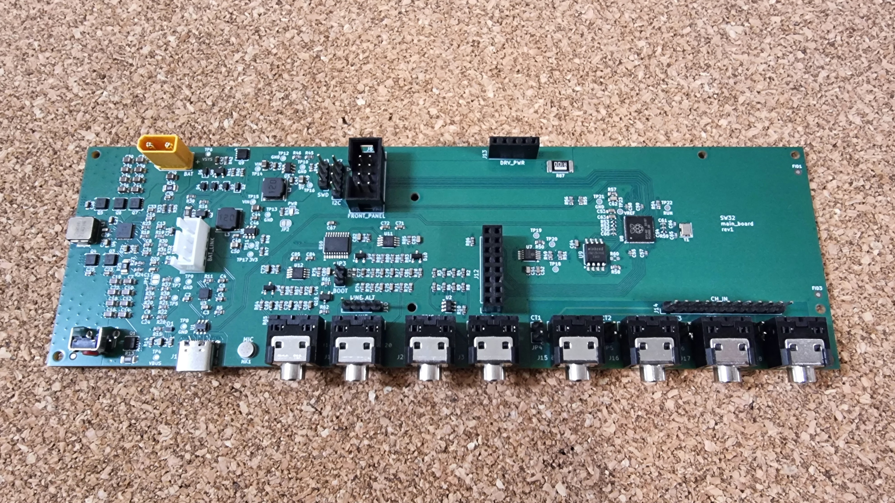{ loading="lazy" width="900" }

### Output Board {: #assembly-output-board }

Image of board as it arrived from JLCPCB:

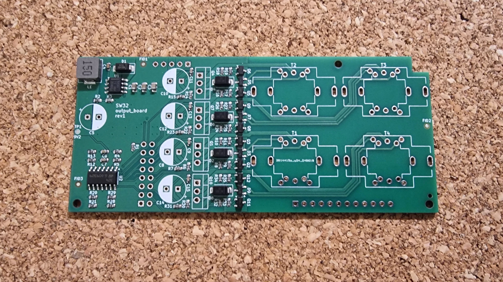{ loading="lazy" width="450" align="left" }

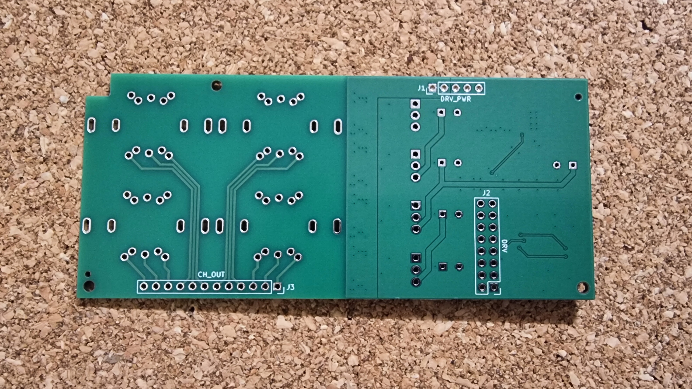{ loading="lazy" width="450" }

- Hand solder through-hole components on the sides indicated by the silkscreen.
- Recommended to solder back components first (J1, J2, and J3), ensure they are aligned correctly by first plugging them into the main board.
- The "P" marking on each transformer (T1, T2, T3, and T4) should face towards J3 (CH_OUT). We are using the transformers in reverse, the primaries going to outputs.
- The 4x MOSFETs (Q1, Q4, Q7, and Q10) should have the exposed metal pad facing towards the transformers.

Fully assembled board:

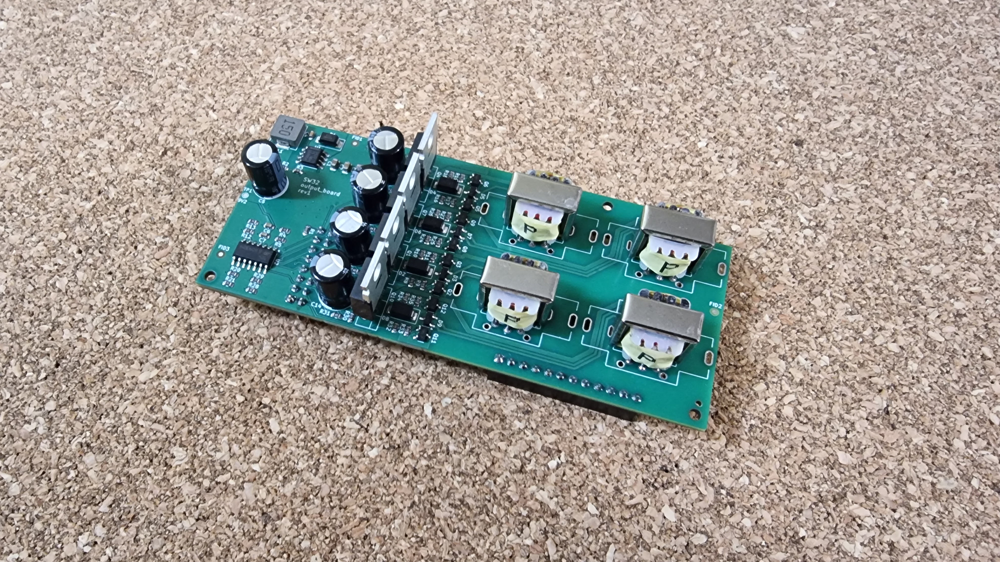{ loading="lazy" width="441" align="left" }

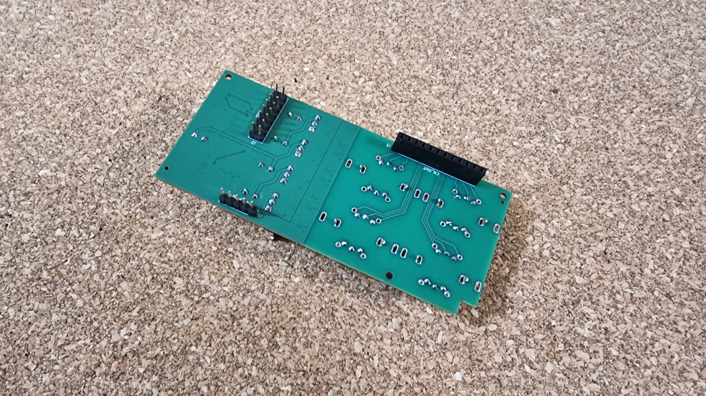{ loading="lazy" width="441" }

Main Board assembly:

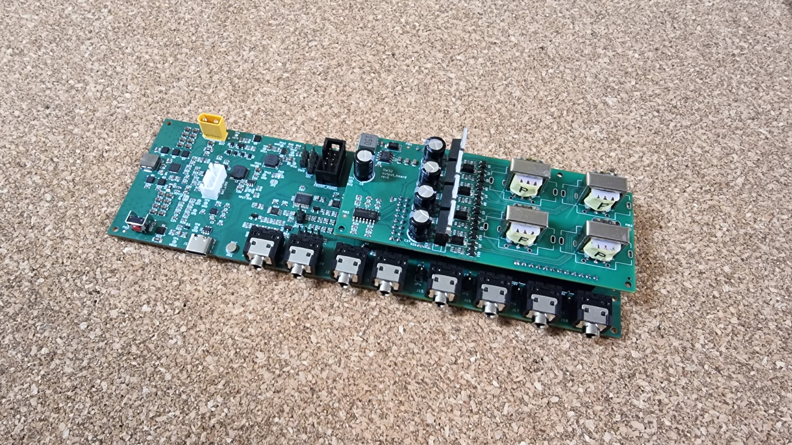{ loading="lazy" width="900" }

### Case {: #assembly-case }

TBW
